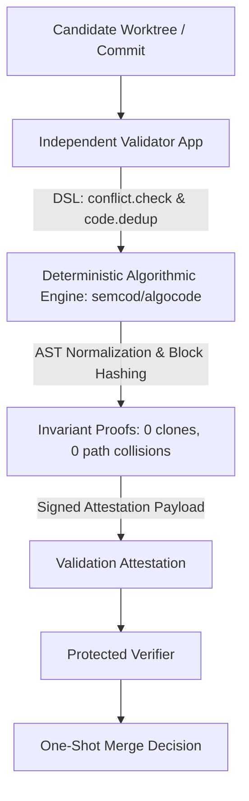

# Architecture

```text
exact candidate + protected policy + current grant
                       |
                       v
              independent Validator App
                       |
                 signed attestation
                       |
                       v
              protected verifier + nonce store
                       |
                one-shot merge decision
                       |
                       v
               publisher -> read-back/EQL
```

The candidate checkout cannot choose trusted issuers, alter the verifier
allowlist, mark a nonce unused or create protected verification evidence. The
validator receives read access to an exact immutable candidate. The publisher
receives only a verified one-shot decision for the exact allowed effect.

An implementer, validator and publisher require different service identities.
The protected verifier is a fourth trust boundary. Running the same model under
different role names is not independence.

## Algocode Evidence & Tripartite Invariant Attestation (semcod/algocode)

In the tripartite communication model between LLM, Human, and Algorithmic engines ([`wellmanifest/nl-dsl-llm`](https://github.com/wellmanifest/nl-dsl-llm)), the **independent Validator App** executes deterministic algorithmic verification via [`semcod/algocode`](https://github.com/semcod/algocode) to produce tamper-proof candidate evidence:



### Deterministic Attestation Invariants:
1. **Zero Path & Workstream Overlap**: Verified algorithmically via `algocode.engine.check_conflict` inspecting `manifest.*.json` and active tickets.
2. **Structural Clone Invariants**: Verified via `algocode.engine.detect_clones` (AST Type-1 & Type-2 normalizer) to guarantee that candidate changes do not introduce copy-pasted implementations or duplicate logic across modules.
3. **DSL-Based Machine Audit**: All findings are exported via MCP / JSON-RPC 2.0 with cryptographic digests, enabling fully automated, replay-resistant PR merging without human fatigue or hallucinated approvals.

